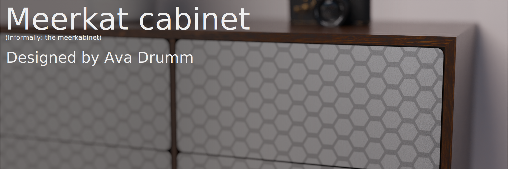

# Idea/vision
This is meant to be a minimalistic wall mounted cabinet/drawer system. It's supposed to look super clean, so no visible screws, ugly joinery, handles or  mounting gear should be visible during regular use. Also I think it would be super cool if the drawers were opened by pushing in on them.

Note: This project has mostly just been trying to figure out how to use FreeCAD and experimenting with some workflows (also I dont really know what Im doing)

# Unfinished things
Here is a list of all the things that arent finalized or havent been made yet:
* The drawers (the internal design depends on the hardware that makes them slide in and out)
* The drawer fronts have to be made from metal and the frame from wood, but the exact materials arent finalized
* The wall mount
* There could always be more/different etching patterns
* How the frame should be assembled
* The depth of the millings for the drawer fronts (called 'groove-depth' in the CAD model)

# Organization / how to edit things
The main CAD file is in FreeCAD format, but there's also a .step version and an .obj version (in the `CAD` folder).
The header image for this file is an inkscape svg and should be edited in inkscape.
The etching patterns and the template for creating more is in the `src` folder, the patterns are png's and the template is an inkscape svg.
I used blender to render the photorealistic images, the file is in `src`.
The technical drawings are in SVG format and were generated by FreeCAD.

# License/copyright
This project is [CC BY-SA](LICENSE.md) licensed so improvement, adaptations and changes are highly encouraged, as long as the project stays under the same free license. The whole point of releasing it onto the internet is so that someone more skilled than me can turn this (in my opinion beatiful) idea into a reality. That of course also includes improving upon it. If you make any changes or improvements just send a pull request, but if you convert things to a proprietary format I will reject it.

# Pictures

